### Software Engineer • AI Engineer • System Builder • Product Builder

Building backend systems, AI-powered applications, and full-stack products.

 

## About Me

I build things that turn ideas into something real combining code, logic, and design to solve problems that matter. I’m always learning, building, and evolving with every system I create.

Most of my work focuses on backend development, scalable APIs, full-stack web applications, and AI-powered software. I enjoy designing clean architectures, solving engineering problems, and learning technologies that help build reliable systems.

Currently exploring Kubernetes, cloud-native infrastructure, distributed systems, and AI agents.
## Tech Stack

### Languages

### Backend

### Frontend

### AI & Data

---

## Featured Projects

<table>
<tr>
<td width="50%" align="center">

### AI Sales Agent

Autonomous AI-powered lead generation and qualification platform.

**FastAPI • Redis • OpenAI**

</td>

<td width="50%" align="center">

### Ecommerce Platform

Modern ecommerce platform with inventory and order management.

**Node.js • PostgreSQL**

</td>
</tr>

<tr>
<td align="center">

### Aqualyn

Real-time messaging platform with scalable backend.

**React • Socket.IO**

</td>

<td align="center">

### Face Recognition

Attendance system using OpenCV.

**Python • OpenCV**

</td>
</tr>
</table>
---

`// GitHub Analytics`
## Metrics & Activity

  <table width="100%">
    <tr>
      <td colspan="2">
        <picture>
          <source media="(prefers-color-scheme: dark)" srcset="./assets/profile/overview.dark.svg" />
          
        </picture>
      </td>
    </tr>
    <tr>
      <td width="50%" valign="top">
        <picture>
          <source media="(prefers-color-scheme: dark)" srcset="./assets/profile/contributions.dark.svg" />
          
        </picture>
      </td>
      <td width="50%" valign="top">
        <picture>
          <source media="(prefers-color-scheme: dark)" srcset="./assets/profile/momentum.dark.svg" />
          
        </picture>
         
        <picture>
          <source media="(prefers-color-scheme: dark)" srcset="./assets/profile/languages.dark.svg" />
          
        </picture>
      </td>
    </tr>
  </table>

---

# Core Focus Areas

| Backend Systems | Automation | AI Integration |
|---|---|---|
| REST APIs | Workflow Automation | AI Agents |
| Distributed Systems | Task Orchestration | LLM Integration |
| Performance Scaling | Data Processing | Intelligent Systems |
| Database Architecture | Event-Driven Systems | AI Products |
| Microservices | Backend Pipelines | ML Applications |

---

## Let's Connect

I'm always interested in discussing software engineering, backend development, AI, and building useful products.

 

  

  

